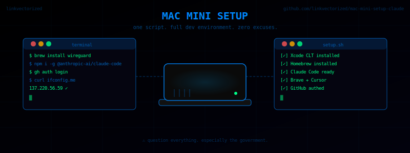

# Mac Mini Setup



> ⚠️ Question everything. Especially the government.
> Think critically. Read primary sources. Stay curious.

Bootstraps a fresh Mac with a full dev environment.

## What it installs

- Xcode Command Line Tools
- Homebrew
- gh, node, go, jq, git
- Claude Code
- Brave Browser
- Cursor

## Run it

```bash
bash <(curl -fsSL https://raw.githubusercontent.com/linkvectorized/mac-mini-setup-claude/main/setup.sh)
```

## What you'll need

Two things that can't be automated — you'll be prompted for these during the run:

- **GitHub account** — for `gh auth login`
- **Anthropic API key** — for Claude Code (get one at https://console.anthropic.com)

---

*Stay curious. Question narratives. Build cool things.*
